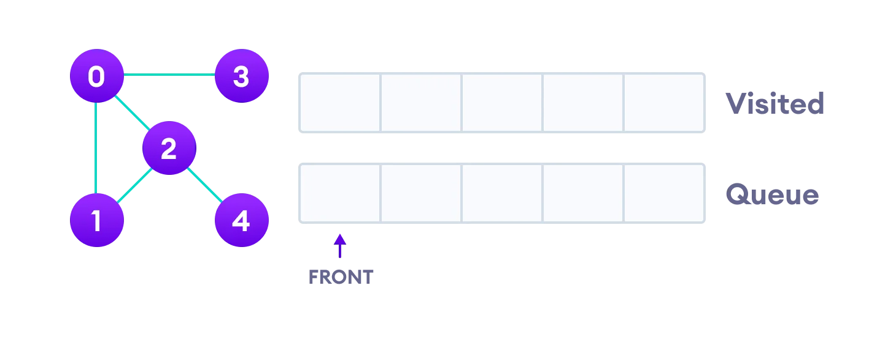
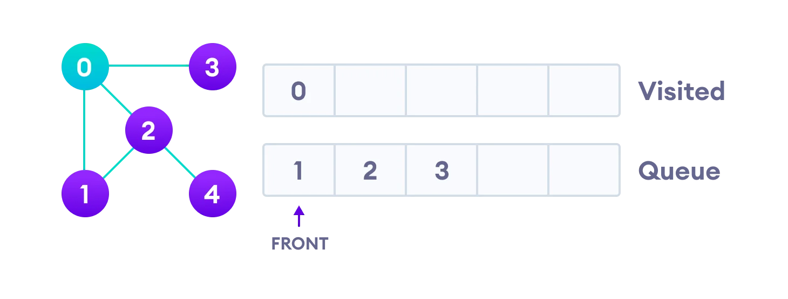
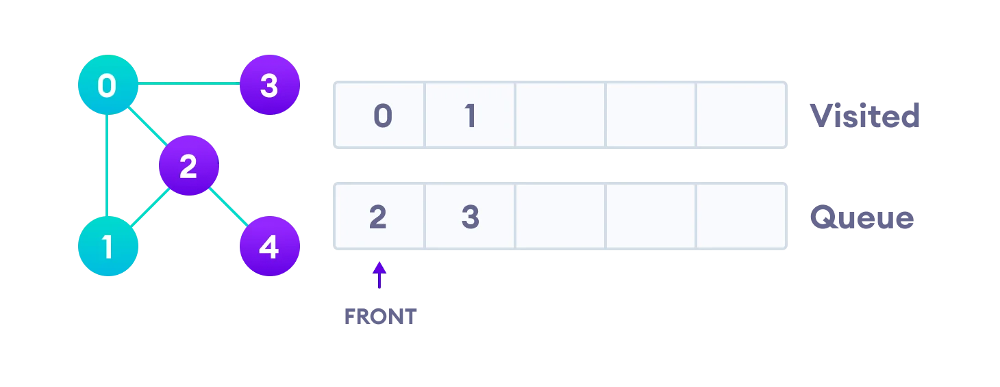
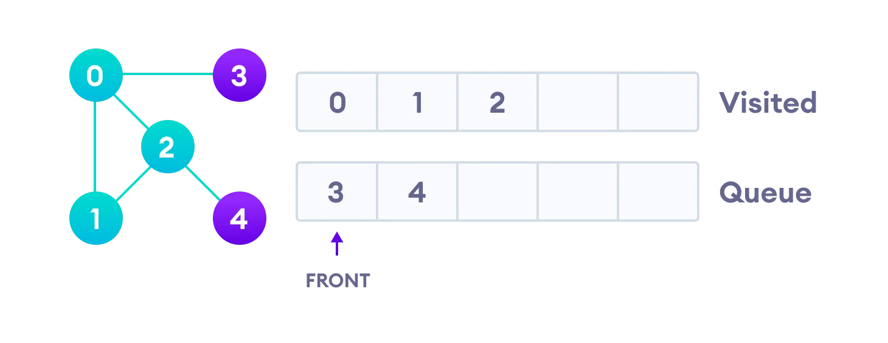

## Breadth first search(BFS)
너비우선탐색

---
## BFS Algorithm

이 알고리즘의 주 목적은 사이클을 피하면서 각 정점을 모두 방문하는 것입니다.

1. 그래프의 정점 중 하나를 대기열 뒤에 배치(Not Visited)
2. 대기열의 맨 앞 항목을 가져와 방문 목록에 추가(Visited)
3. 방문한 정점의 인접하는 모든 노드들중에서 방문 기록이 없는 항목들을 대기열 뒤쪽에 추가합니다.(Not Visited)
4. 대기열이 비어있을때까지 2,3단계를 반복합니다.

---
# BFS Example

1.정점이 5개인 무방향 그래프를 사용한다. 큐를 2개 준비한다.

2.점정 0에서 시작하여 Visited에 넣고, 인접 정점들을 스택에 넣는다.

3.다음으로 스택 가장 맨 앞에 있는 요소를 Visited로 옮기고, 해당하는 값의 인접노드중 방문기록에 없고, 스택에 쌓이지 않는 노드들만 스택(Queue)에 다시 쌓아준다.

4. ㄴㅇㄹ

5. ㄴㅇㄹ

--
