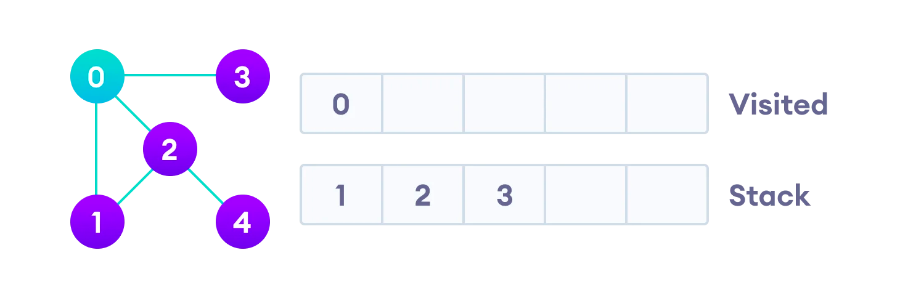
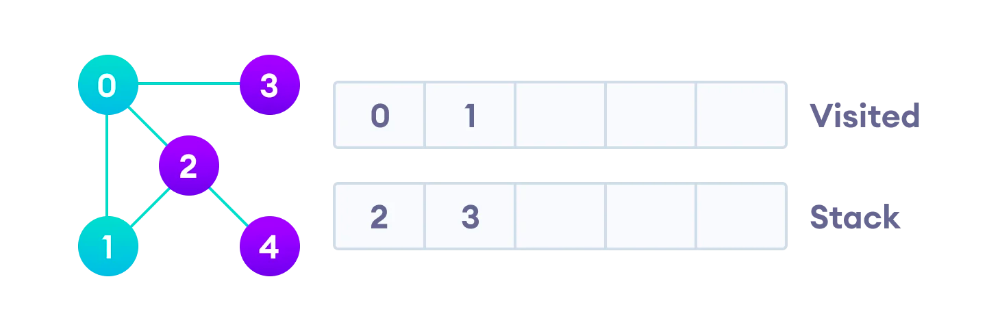
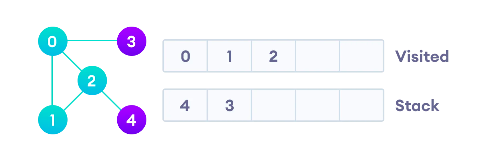
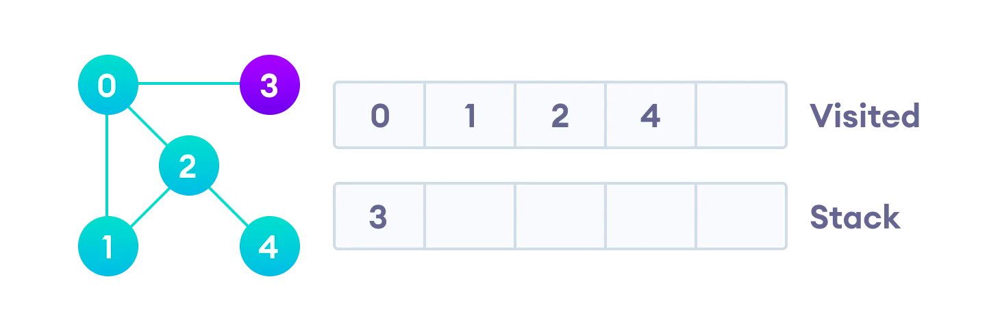
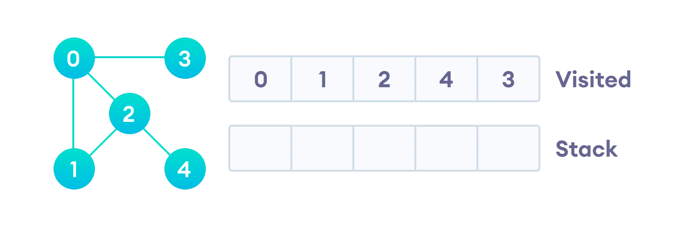

## Breadth first search(BFS)
너비우선탐색

---
## BFS Algorithm

시작점부터 시작해서 가까운 정점부터 순서대로 방문하는 탐색 알고리즘. 스택구조로는 구현이 어렵기 때문에 큐 자료구조를 사용한다.

1. 그래프의 정점 중 하나를 대기열 뒤에 배치(Not Visited)
2. 대기열의 맨 앞 항목을 가져와 방문 목록에 추가(Visited)
3. 방문한 정점의 인접하는 모든 노드들중에서 방문 기록이 없는 항목들을 대기열 뒤쪽에 추가합니다.(Not Visited)
4. 대기열이 비어있을때까지 2,3단계를 반복합니다.

---
# BFS Example

1.정점이 5개인 무방향 그래프를 사용한다.


2.점정 0에서 시작하여 Visited에 넣고, 인접 정점들을 Not Visited에 넣는다.


3.다음으로 스택 가장 맨 앞에 있는 요소를 Visited로 옮기고, 해당하는 값의 인접노드중 Visited에 없고, Not Visited에 없는 노드들만 Not Visited에 다시 쌓아준다.


4. 2~3을 대기열이 비어있을때까지 계속 반복합니다.


---
## BFS pseudocode

```
create a queue Q
mark v as visited and put v into Q
while Q is non-empty
remove the head u of Q
mark and enqueue all (unvisited) neighbours of u 
```

---

## BFS Java Examples

```java
import java.util.*;

public class Graph {
private int V;
private LinkedList<Integer> adj[];

// Create a graph
Graph(int v) {
V = v;
adj = new LinkedList[v];
for (int i = 0; i < v; ++i)
adj[i] = new LinkedList();
}

// Add edges to the graph
void addEdge(int v, int w) {
adj[v].add(w);
}

// BFS algorithm
void BFS(int s) {

    boolean visited[] = new boolean[V];

    LinkedList<Integer> queue = new LinkedList();

    visited[s] = true;
    queue.add(s);

    while (queue.size() != 0) {
      s = queue.poll();
      System.out.print(s + " ");

      Iterator<Integer> i = adj[s].listIterator();
      while (i.hasNext()) {
        int n = i.next();
        if (!visited[n]) {
          visited[n] = true;
          queue.add(n);
        }
      }
    }
}

public static void main(String args[]) {
Graph g = new Graph(4);

    g.addEdge(0, 1);
    g.addEdge(0, 2);
    g.addEdge(1, 2);
    g.addEdge(2, 0);
    g.addEdge(2, 3);
    g.addEdge(3, 3);

    System.out.println("Following is Breadth First Traversal " + "(starting from vertex 2)");

    g.BFS(2);
}
}
```
---

## Depth First Search(DFS)
깊우선탐색

---
## DFS Algorithm

주기를 피하면서 각 정점을 방문하는 탐색 알고리즘. 스택 자료구조를 사용한다.

1. 스택의 맨 위에 그래프의 정점 중 하나를 배치하여 시작합니다.
2. 스택의 맨 위 항목을 가져와 방문 목록에 추가합니다.
3. 해당 꼭짓점의 인접 노드 목록을 만듭니다. 방문 목록에 없는 것을 스택의 맨 위에 추가합니다.
4. 스택이 비워질 때까지 2단계와 3단계를 계속 반복합니다.

---
# DFS Example

1.정점이 5개인 무방향 그래프를 사용한다.


2.정점 0에서 시작하여 Visited 목록에 넣고 모든 인접 정점을 스택에 넣는 것으로 시작합니다.



3.다음으로 스택의 맨 위에 있는 요소, 즉 1을 방문하고 인접한 노드로 이동합니다. 0이 이미 방문되었으므로 대신 2를 방문합니다.



4.정점 2는 4에 방문하지 않은 인접 정점이 있으므로 스택의 맨 위에 추가하고 방문합니다.




4.마지막 요소 3을 방문한 후 방문하지 않은 인접 노드가 없으므로 그래프의 Depth First Traversal을 완료했습니다.



---
## DFS pseudocode

```
DFS(G, u) 
    u.visited = 
    각 v에 대해 참 ∈ G.Adj[u] 
        if v.visited == false 
            DFS(G,v) 
     
init() { 
    각 u에 대해 ∈ G 
        u.visited = false 
     각각 에 대해 유 ∈ G 
       DFS(G, 유) 
}
```

---

## DFS Java Examples
```java
// DFS algorithm in Java

import java.util.*;

class Graph {
  private LinkedList<Integer> adjLists[];
  private boolean visited[];

  // Graph creation
  Graph(int vertices) {
    adjLists = new LinkedList[vertices];
    visited = new boolean[vertices];

    for (int i = 0; i < vertices; i++)
      adjLists[i] = new LinkedList<Integer>();
  }

  // Add edges
  void addEdge(int src, int dest) {
    adjLists[src].add(dest);
  }

  // DFS algorithm
  void DFS(int vertex) {
    visited[vertex] = true;
    System.out.print(vertex + " ");

    Iterator<Integer> ite = adjLists[vertex].listIterator();
    while (ite.hasNext()) {
      int adj = ite.next();
      if (!visited[adj])
        DFS(adj);
    }
  }

  public static void main(String args[]) {
    Graph g = new Graph(4);

    g.addEdge(0, 1);
    g.addEdge(0, 2);
    g.addEdge(1, 2);
    g.addEdge(2, 3);

    System.out.println("Following is Depth First Traversal");

    g.DFS(2);
  }
}

```

