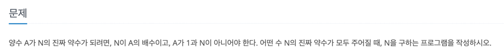
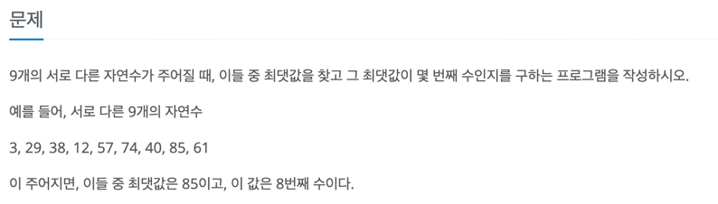
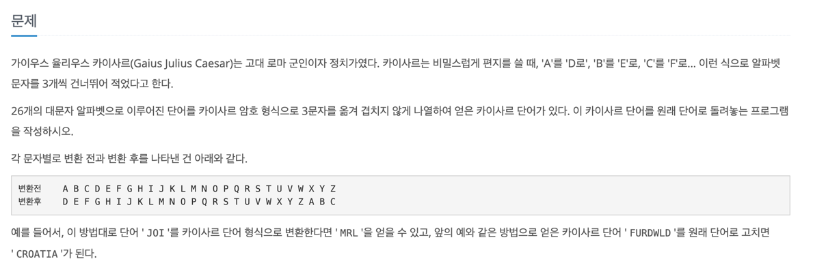
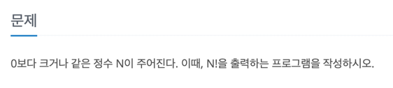

# 백준 > 구현

- N1037: 약수

https://www.acmicpc.net/problem/1037

- N2562 : 최댓값

  https://www.acmicpc.net/problem/2562
  

- N5598 : 카이사르 암호

  https://www.acmicpc.net/problem/5598
  

- N10872 : 팩토리얼

  https://www.acmicpc.net/problem/10872